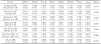
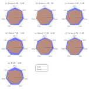
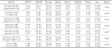
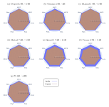

# Benchmarking Pruning Techniques to Reduce the Energy Impact of Large Language Models: the Case of _LLMPruner_

This repo investigates the impact of LLM model pruning techniques, specifically LLMPruner, on both model efficiency and environmental sustainability. The research analyzes a selection of open-source pre-trained LLM models from huggingface. The results showed that an average reduction of 20\% in parameters can result in energy savings on the order of 10\%, but with an average accuracy loss of 12\%, which is not negligible and very model and task dependent. In some specific scenarios the approach proved more effective, but overall the benefits were not substantial enough to make the method immediately applicable on a large scale without further optimization.

---

## Methodology

The figure below illustrates the four main stages of the research methodology:

1. **Model Selection** – LLMs under 9B parameters were selected from HuggingFace based on popularity and relevance for SMEs.  
2. **Pruning** – Models were compressed using Torch-Pruning with Taylor importance.  
3. **Retraining** – LoRA Fine-tuning was performed to recover potential accuracy loss.  
4. **Benchmarking** – Models were evaluated for accuracy and energy consumption on seven commonsense reasoning tasks.

<a href="./assets/metodologia.drawio.svg">
  
</a>


## Usage

Clone the repository

```bash
git clone https://github.com/Cyber-Vadok/GreenPruning/
```

Create a venv and install dependencies:

```bash
cd GreenPruning/
pip install -r requirements.txt
```

The [`src/scripts`](./src/scripts) folder contains the shell scripts used to replicate the results for each model.

To run an experiment, simply navigate to the `src` directory and execute the corresponding script. For example, to run the pipeline on **LLaMA 3.1**:

```bash
cd src/
bash scripts/llama3-1.sh
```

---


## Results Summary

### Test Environment

* **CPU**: AMD Ryzen 9 7900X
* **GPU**: NVIDIA GeForce RTX 4090

The results are presented in the following sections through both **tables** and **radar charts**, offering a comprehensive view of model behavior before and after pruning.

The section [**Accuracy**](#accuracy) reports the performance of each model on seven commonsense reasoning benchmarks, while [**Energy Consumption**](#energy-consumption) shows the corresponding energy usage expressed in watt-hours (Wh). In both sections, results are provided for models in their original and pruned forms.

Tables present the accuracy and energy consumption values across the following datasets: ARC-Challenge (ARCC), ARC-Easy (ARCE), BoolQ, HellaSwag (Hella), PIQA, OpenBookQA (OBQA), and WinoGrande (Wino). The last two columns in each table indicate the average value across datasets (Avg.) and the corresponding Ratio, defined as the average value of the pruned model divided by that of the vanilla model. Each model is represented by a pair of rows, enabling a direct comparison between the original and compressed versions.

Radars represents, respectively, the accuracy and energy consumption of the evaluated models across the same seven datasets. To enable consistent visual comparison among models of different sizes, values have been normalized per task. For each model, both the vanilla (blue line) and pruned (orange line) configurations are displayed in the same radar plot, illustrating their relative performance across all tasks.

### Accuracy
**Table 1** : Accuracy of original and compressed models on commonsense datasets.

<a href="./assets/accuracy.svg">
  
</a>

<!-- Vertical spacer: 4 lines -->
<br><br><br><br>

**Figure 1** : Normalized radar charts showing the accuracy of original models (blue) and pruned models (orange) across the seven benchmarking datasets.

<a href="./assets/radar_accuracy.svg">
  
</a>

<br><br>

### Energy Consumption
**Table 2** : Energy consumption (in Wh) of original and pruned models during the benchmarking phase.

<a href="./assets/my-table.svg">
  
</a>

<!-- Vertical spacer: 4 lines -->
<br><br><br><br>


**Figure 2** : Normalized radar charts illustrating the energy consumption (in Wh) of original models (blue) and pruned models (orange) across the seven benchmarking datasets.

<a href="./assets/my-table.svg">
  
</a>

<br><br>

## Changes to torch-pruning
Added support for skipping the first and last layers during pruning.
```python
    layer_names = [name for name, _ in model.named_modules() if name.endswith(("self_attn", "mlp"))]
    # *2 = self_attn + mlp
    start_idx = 0
    end_idx = len(layer_names)
    if args.ignore_first_x_layers > 0:
        start_idx = args.ignore_first_x_layers * 2
    if args.ignore_last_x_layers > 0:
        end_idx -= args.ignore_last_x_layers * 2
    layers_to_process = layer_names[start_idx:end_idx]
```

## Changes lm-eval-harness
Integrated CodeCarbon to track energy consumption during model inference.

```python
    tracker.start()
        print("Running", reqtype, "requests")
        resps = getattr(lm, reqtype)([req.args for req in reqs])
        
        resps = [
            x if req.index is None else x[req.index] for x, req in zip(resps, reqs)
        ]

        for resp, (i, task_name, doc, doc_id) in zip(resps, requests_origin[reqtype]):
            process_res_queue[(task_name, doc_id)].append((i, resp))

    tracker.stop()
```

## Credits
This project is licensed under the MIT License - see the [LICENSE](LICENSE) file for details. 
It includes code from:
 * [Torch-Pruning](https://github.com/VainF/Torch-Pruning) (MIT License)
 * [LLM-Pruner](https://github.com/horseee/LLM-Pruner) (Apache 2.0 License)
 * [lm-evaluation-harness](https://github.com/EleutherAI/lm-evaluation-harness) (MIT License)

